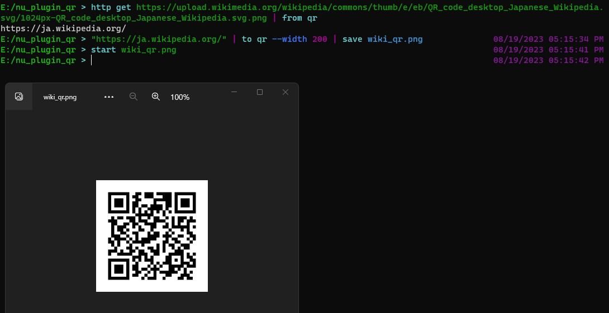

A plugin for nushell to decode/encode qrcode.



### Install

```
cargo install nu_plugin_qr
register ~/.cargo/bin/nu_plugin_qr
```

### Usage

plugin is install as subcommands of `from` and `to`.


Convert from qrcode:

```nu
open qrcode.png | from qr
```

Convert to qrcode:

```nu
"test" | to qr --width 300 --shape circle | save qrcode.png
```